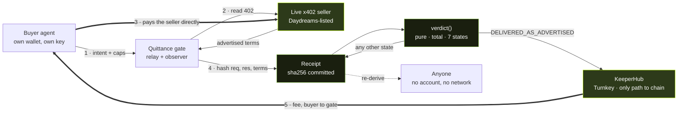

<div align="center">

<h1>Quittance</h1>

<p><em>A quittance is the document certifying that a debt has been discharged.</em></p>

<h3>Delivery is an assertion. Quittance makes it re-derivable.</h3>

</div>

<p align="center">
  
  
  
  
  
  
</p>

---

An agent pays for an API call over x402. Nothing checks whether the call was answered. The only
signals available are ones the seller publishes about itself — uptime it reports, a rank in a
directory, a star count — none of it derived from whether the last thousand paid calls returned
anything.

Quittance sits in the gap x402 leaves between verification and settlement, and turns delivery from
something asserted into something measured.

**Read the seller's own terms. Hash what came back. Let a pure function decide. Charge only when it delivered.**

[Live app](https://quittance-web-3g54.vercel.app) ·
[Evidence room](evidence/) ·
[Verify it yourself](TESTING.md) ·
[Run locally](SETUP.md) ·
[What is measured](WHAT_IS_MEASURED.md) ·
[Decisions](DECISIONS.md)

> **Stage: working build, partial evidence. Read this before anything below.**
>
> Nine of ten acceptance gates pass. Value has moved on Base mainnet and the receipts are real.
> **But:** two of seven claims are still at rung R0 — asserted, not executed. G6 is unbuilt. G7's
> live half has never been run by a stranger.
> Facilitator mode and the receipt anchor were **cut** under our own kill criterion, and that is
> recorded with what it cost.
>
> Quittance does **not** protect a buyer. The buyer pays the seller directly; a failed call still
> costs them the purchase price and we recover nothing. The only thing that changes on a failure is
> that **we are not paid**. Structural conformance is also a low bar — an endpoint can pass every
> check here and return content that is useless.

## Demo

**[Watch on YouTube](https://youtu.be/F8fvQNC44wE)** — 4m58s, 1080p 24fps, failure path first per PRD §23.

Archival copy in the repo: [`evidence/quittance_demo.mp4`](evidence/quittance_demo.mp4) (17.6 MB, h264/aac).

The video walks through the mechanism chain without mockups or simulated frames:
1. **The two legs named honestly** — purchase leg direct to seller; fee leg governed by Quittance and executed via KeeperHub.
2. **Live terms advertised at call time** — dynamic payment requirement negotiation over HTTP 402 with `dicex402.vercel.app`.
3. **Failure path first** — HTTP 404 from `chat.gedx402.com`, `NOT_DELIVERED` verdict recorded, and zero KeeperHub execution.
4. **Structural delivery path** — HTTP 200 from `dicex402.vercel.app`, `DELIVERED_AS_ADVERTISED`, executed fee transfer on Base mainnet (`0x015f4520...`) via KeeperHub run `b56dusna0v6diklwih7eu`.
5. **Independent re-derivation** — `quittance verify` re-deriving the verdict byte-identically on an air-gapped machine.
6. **Candid limitations** — structural conformance only (no semantic quality evaluation), trusted observer boundary.

## Try it without a wallet

Nothing below needs an account, a key, or funds.

| What you want to check | Where | What you should see |
|---|---|---|
| The ledger is real | [`/receipts`](https://quittance-web-3g54.vercel.app/receipts) | 343 gated calls against live third-party x402 endpoints |
| A call that was **not** paid for | filter to `NOT_DELIVERED` | HTTP 502 and **no transaction** — the absence is the evidence |
| Re-derive a verdict yourself | [`/verify`](https://quittance-web-3g54.vercel.app/verify) | Paste a receipt → it re-derives **in your browser** |
| That verification needs nothing from us | `/verify`, network disconnected | It still works |
| We are not flattering ourselves | [`/endpoints`](https://quittance-web-3g54.vercel.app/endpoints) | `INSUFFICIENT SAMPLE` under 20 calls, never a percentage |
| Money actually moved | [BaseScan](https://basescan.org/tx/0x015f4520b2e897fa392ac63ab863d4d1d52452682dc9fafbfe4be5c96f160852) | A USDC transfer that happened because a check passed |

## Contents

- [Why this exists](#why-this-exists)
- [Architecture](#architecture)
- [The mechanism, step by step](#the-mechanism-step-by-step)
- [Live evidence](#live-evidence)
- [Verify it yourself](#verify-it-yourself)
- [What is real and what is not](#what-is-real-and-what-is-not)
- [Engineering decisions and the hard problems](#engineering-decisions-and-the-hard-problems)
- [Repository map](#repository-map)
- [Trust boundaries and limitations](#trust-boundaries-and-limitations)
- [Attribution and licence](#attribution-and-licence)

## Why this exists

x402 splits payment into two steps. **Verification** checks a signed payload and moves no money.
**Settlement** broadcasts it and moves the money. The actual work sits between them, and whoever
wrote the resource server picks the ordering — so the buyer's protection is a property of the
seller's own code.

The obvious fix is a smart contract holding funds until the work is confirmed. It does not work:
per-call micropayments cannot carry an arbitration process costing more than the call, and an
on-chain arbiter cannot read an HTTP response body.

What is left is an execution problem — hold a signed authorization, run a check anyone can re-run,
then get one transaction to land reliably. **KeeperHub is that execution layer. Quittance is the
thin, checkable policy deciding what it executes.**

## Architecture



The thick arrows are the two money movements. **Only the fee is KeeperHub-executed.** The purchase is
paid and signed by the buyer and broadcast by the seller's own facilitator — it is never described as
a KeeperHub execution.

## The mechanism, step by step

1. **Intent.** The buyer posts a target, a maximum price, a maximum latency, and a pre-signed fee
   authorization with a nonce and an expiry.
2. **Quote.** The gate requests the resource, receives 402, and parses the seller's own terms. If the
   advertised price exceeds the buyer's cap it refuses **here** — `REQUIREMENTS_MISMATCH`, no
   purchase, nothing spent.
3. **Call.** The buyer signs the x402 payment with its own wallet; the gate relays it, honouring the
   request shape the seller declares. The gate never signs and never pays the seller.
4. **Commit.** Request, response and raw advertised terms are hashed into a receipt, along with
   timings, the run context, and **which checks were available at all**.
5. **Judge.** `verdict(advertised, observed)` runs from the receipt alone — pure, total, seven
   enumerated states, no clock, no network.
6. **Settle.** On `DELIVERED_AS_ADVERTISED`, KeeperHub executes the fee as a contract call, keyed for
   idempotency by the authorization nonce. Every other state records a non-discharge and moves
   nothing.
7. **Publish.** The receipt is written under its own leaf hash, so the filename is a checkable claim.

## Live evidence

Real transactions on Base mainnet. Every hash resolves.

| Property | Evidence | Rung |
|---|---|---|
| Value moved through KeeperHub, triggered by a live listed endpoint | [`0x015f4520…`](https://basescan.org/tx/0x015f4520b2e897fa392ac63ab863d4d1d52452682dc9fafbfe4be5c96f160852) · block 51,349,475 | **R2** |
| A duplicate submission produces **exactly one** discharge | [`0xa65b14a8…`](https://basescan.org/tx/0xa65b14a881352663f343506be15cdad4f9fbf467cac0ebf928479bcff2386ccd) · `idempotentReplay: true` | **R2** |
| Non-delivery recorded against a live third party, **no fee charged** | `api.onesource.io` → HTTP 502, `dischargeTxHash: null` | **R2** |
| A discharge fires only on `DELIVERED_AS_ADVERTISED` | 303 fee transactions, 40 non-discharges, zero exceptions | **R2** |
| Every published verdict re-derives byte-identically | 343 receipts, enforced in CI by `pnpm test:properties` | — |
| Sustained campaign, failures included in the published count | [130 calls / 114 discharges / 16 non-discharges over 24h 26m](evidence/campaigns/) · 31 hosts | **R3** |
| No compiled-in protocol fact | `pnpm probe:all` reads terms live and fails closed | **G1** |

**343 receipts · 32 distinct hosts · 303 fee transactions · 61 tests · 46.6-hour window.**
Claims and their rungs: [`docs/claims.md`](docs/claims.md), generated from
[`claims.json`](packages/claim-ledger/data/claims.json) and never hand-edited.

## Verify it yourself

From a clean clone. No key, no account, no funds.

```bash
git clone https://github.com/Dotman-Bei/Quittance.git && cd Quittance
pnpm install && pnpm build

# all 343 published receipts, re-derived with no access to anything of ours
for f in evidence/receipts/*.json; do
  node packages/verifier/dist/cli.js verify "$f" || echo "MISMATCH: $f"
done

pnpm test            # 61 tests: purity, totality, canonicalization, the golden corpus
pnpm skills:verify   # re-hash 47 pinned upstream docs — no claim rests on memory
pnpm claim:verify    # no claim above its evidence, no missing evidence file
```

Read live protocol terms yourself — nothing is compiled in:

```bash
export PROBE_X402_TARGETS="https://api.onesource.io/api/chain/block-number"
export KEEPERHUB_API_BASE_URL="https://app.keeperhub.com"
pnpm probe:all
```

The guided path, including a live gated call with your own wallet, is **[TESTING.md](TESTING.md)**.

## What is real and what is not

| | Status |
|---|---|
| `verdict()`, receipts, canonicalization, verifier CLI | **real**, 61 tests |
| Gate service, quote + call, KeeperHub fee execution | **real**, 179 mainnet transactions |
| Probes reading live x402 and KeeperHub surfaces | **real**, fails closed on drift |
| Web surfaces, client-side re-derivation | **real**, 30 e2e tests across 5 viewports |
| Adversarial endpoint (`apps/baseline`) | **real**, and labelled `PROJECT_BASELINE` everywhere |
| Sustained 24h campaign (G5) | **passed** — 130 calls over 24h 26m, totals published with every failure |
| Recovery under induced failure (G6) | **not built** |
| Facilitator mode, `ReceiptAnchor` | **cut** under kill criterion K8 — see [D-008](DECISIONS.md) |
| Third-party adoption | **none.** Nothing here is evidence of demand |

There are **no mocks on the public proof path**. Anything from our own endpoint carries
`PROJECT_BASELINE` and is excluded from every third-party count.

## Engineering decisions and the hard problems

Fifteen decisions are recorded in [DECISIONS.md](DECISIONS.md) — append-only, each with what was
decided, what evidence forced it, and what it costs. The ones worth reading:

**[D-002](DECISIONS.md) / [D-005](DECISIONS.md) — the spec does not say what we needed it to say.**
x402 advertises **no response-latency SLA** in either version; `maxTimeoutSeconds` is a payment
window, measured at 60–3600s across live sellers. And v2 removed `outputSchema` without replacing it
— the bazaar extension's `schema` validates the *discovery metadata*, not the response. So
`TIMEOUT_EXCEEDED` derives from the **buyer's** deadline, and schema conformance is checked against
**nobody**.

**[D-007](DECISIONS.md) / [D-009](DECISIONS.md) — the original design could not be built.**
x402 requires the *payer* to produce an EIP-712 signature, and the only path to chain available here
refuses to sign to an arbitrary recipient (`403 PAYTO_MISMATCH`). Four options were costed; the one
chosen inverts the legs and **removes the underwriting story entirely** rather than quietly keeping
the claim.

**[D-011](DECISIONS.md) — the ABI you are handed is the wrong one.** KeeperHub's ABI auto-fetch
returns the *proxy* ABI for USDC, which does not expose `transferWithAuthorization`. The
implementation is not at the EIP-1967 slot either. The ABI is now resolved from the deployed contract
at runtime; if it cannot be read, the fee is **not attempted** rather than guessed.

**[D-012](DECISIONS.md) — a seller must not shape a signature it is not party to.** The fee's EIP-712
domain was being taken from the seller's advertised `extra`. A seller advertising `"USDC"` against a
contract whose domain is `"USD Coin"` broke it. The fee domain now comes from the contract; the
adversarial fixture keeps lying on purpose, so the suite passing asserts the property.

**[D-014](DECISIONS.md) / [D-015](DECISIONS.md) — the two bugs nothing caught.** One published a
verdict that could not be re-derived; one deleted the entire receipt corpus from a test teardown and
committed it. **51 passing tests saw neither.** Both were found by looking from outside — a
clean-room clone, and a live deployment. Both are now enforced automatically, and the receipts that
prove the first are [published rather than deleted](evidence/baseline-runs/).

## Repository map

```
apps/
  gate/         quote → relay → observe → judge → settle        Hono
  baseline/     our own endpoint, configured to fail 5 ways     PROJECT_BASELINE
  web/          receipts, endpoints, client-side verifier       Next.js
  facilitator/  cut under K8
packages/
  protocol-types/  x402 v1+v2 as discriminated schemas, receipt, canonical JSON, sha256
  reference/       verdict() — pure, total, seven states
  verifier/        independent re-derivation + `quittance verify` CLI
  claim-ledger/    claims.json, the source of truth for every claim
scripts/
  probe-x402 · probe-keeperhub · probe-all · campaign · claim-verify · submission-check
evidence/
  receipts/       201 published, all re-deriving
  baseline-runs/  our own runs, kept out of the ledger, including 2 that do not re-derive
  probes/         live protocol-fact runs
.agents/skills/   47 pinned upstream docs, hashed in skills-lock.json
```

## Trust boundaries and limitations

**The gate is the only observer of the response bytes**, and it earns a fee when it reports delivery.
That incentive is real and new — under the abandoned design a false negative cost us a purchase
price; now it costs a fee, and a false positive earns one. The receipt's commitment to
`sha256(response)` is the **only** check on it, and it requires someone holding the bytes to bother.

**Structural conformance is a low bar.** Status, non-empty body, declared content type, and a
deadline the buyer chose. Measured across 38 live sellers: all 38 publish a `mimeType`, **none**
publishes a response schema. Correctness, accuracy and usefulness are never measured.

**Most non-discharges in our own data were our fault.** Of 60 sellers paid, 13 did not deliver — but
**11 of those were malformed requests from us**, not seller failures. Endpoint pages show which
checks were available so our error rate cannot be read as theirs.

**Not** an escrow protocol, an arbitration system, a dispute court, a reputation score, a wallet, a
key manager, or an agent framework. One network, done properly, or not claimed.

The long version, written against this project on purpose, is
**[WHAT_IS_MEASURED.md](WHAT_IS_MEASURED.md)**.

## Attribution and licence

Built for the KeeperHub Agent Economy Hackathon. Live counterparty: x402 resources listed in the
public discovery index on Base mainnet.

Upstream findings produced from real friction, **filed 2026-09-17** against
[`x402-foundation/x402`](https://github.com/x402-foundation/x402):

- [**#3510**](https://github.com/x402-foundation/x402/issues/3510) — a live resource advertises
  `amount: "0.111"` where the spec says atomic units, and the spec states no constraint to cite.
- [**#3511**](https://github.com/x402-foundation/x402/issues/3511) — a resource's bazaar
  `info.input` changes depending on which HTTP method you probe it with.

Both cost us real failed calls before they were understood. Working notes, including a dated
correction to one of them, are in
[`docs/upstream/`](docs/upstream/2026-09-16-x402-discovery-conformance.md).

Further reading: [PRD.md](PRD.md) · [ARCHITECTURE.md](ARCHITECTURE.md) · [SECURITY.md](SECURITY.md) ·
[AGENTS.md](AGENTS.md) · [docs/phase.md](docs/phase.md) · [docs/kill-criteria.md](docs/kill-criteria.md)

**Contact** — bamigboyeemmanuel401@gmail.com · [@heisbei02](https://x.com/heisbei02)

MIT.
